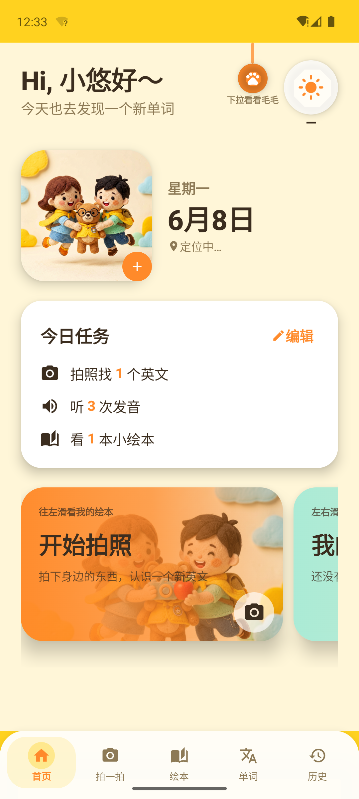
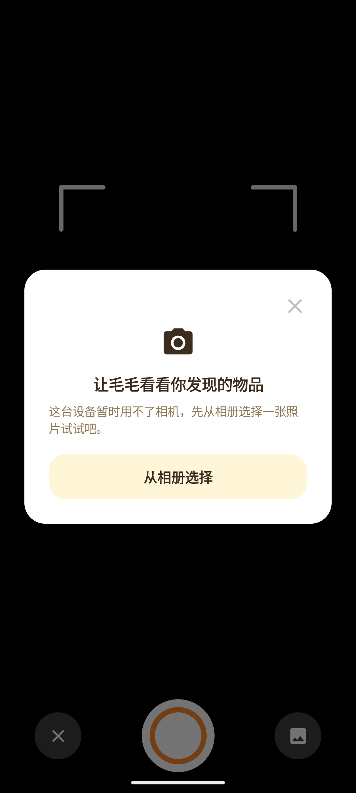
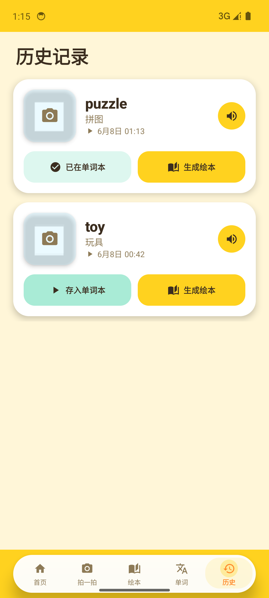
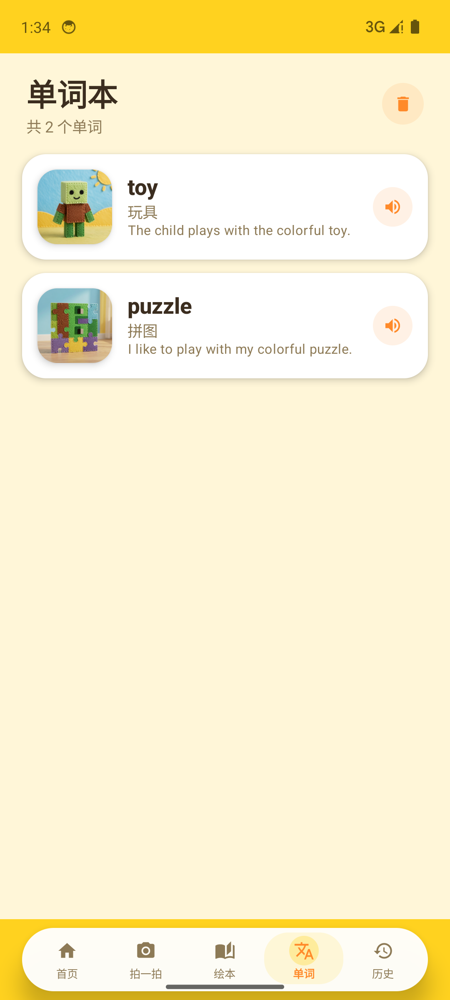
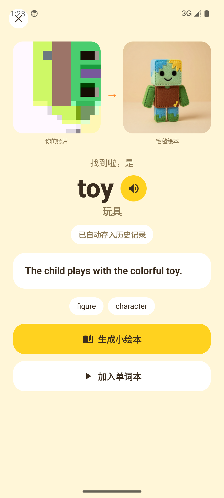
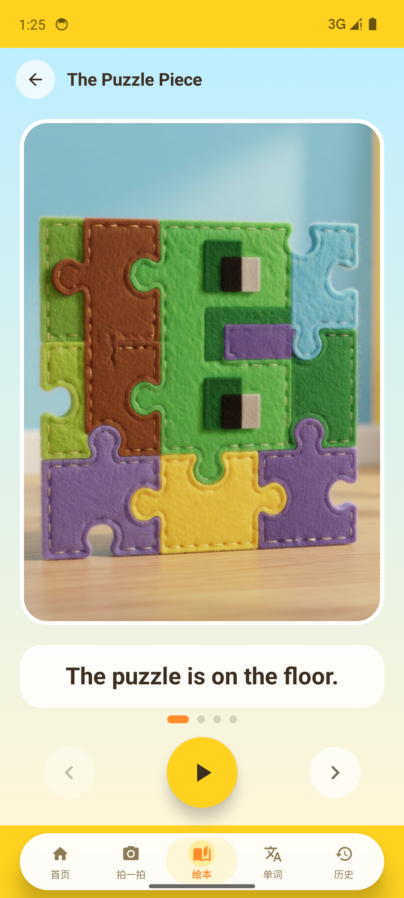
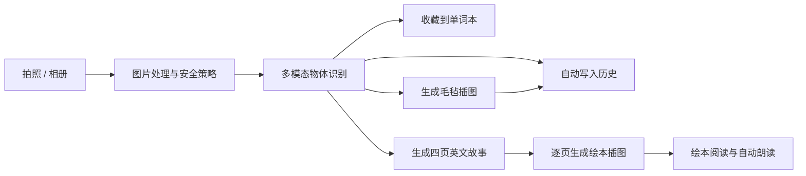

# 毛毛英语绘本 · FeltWords

> 用孩子身边的真实物品，生成属于自己的英文毛毡小绘本。
> Turn everyday objects into a child's own illustrated English storybook.

FeltWords 是一个面向 3-8 岁儿童的 AI 英语启蒙 App。孩子拍摄身边的物品，App 识别英文单词、生成毛毡风插图与四页英文故事，并通过语音朗读形成完整学习闭环。

<p>
  <strong>Android：</strong>当前主要可运行与已验收版本　
  <strong>iOS：</strong>源码已提供且编译通过，尚未完成完整运行验收
</p>

## 为什么做这个产品

传统单词卡让孩子记住的是预设图片。FeltWords 希望孩子从自己的生活出发：

```text
拍摄真实物品 → 认识英文单词 → 收藏到单词本
→ 生成毛毡绘本 → 自动朗读 → 再次复习
```

产品不做开放式儿童聊天，也不追求复杂课程系统。核心理念是：

> 真实世界就是孩子的第一本英语教材。

## 产品截图

### Android 已验收版本

| 首页 | 下拉 IP 场景 | 拍照识别 | 识别结果 |
| --- | --- | --- | --- |
|  |  |  |  |

| 历史记录 | 单词本 | 我的绘本 | 绘本阅读器 |
| --- | --- | --- | --- |
|  |  |  |  |

## 核心能力

- **拍照识词**：拍照或从相册选择物品，通过多模态模型识别英文单词。
- **毛毡插图**：将真实物品转化为统一的儿童毛毡绘本视觉。
- **AI 小绘本**：围绕识别单词生成四页低龄英文故事与逐页插图。
- **自动朗读**：支持单词和故事播放、暂停、自动翻页与末页重播。
- **自动历史**：识别完成后立即保存，记录时间、单词与生成插图。
- **单词本**：主动收藏、去重、删除与撤销，帮助后续复习。
- **我的绘本**：后台生成、加载状态、失败重试、阅读与删除管理。
- **儿童友好交互**：大按钮、柔和配色、毛玻璃底栏、弹簧反馈与品牌 IP。
- **本地优先保存**：历史、单词、绘本与生成图片保存在设备本地。
- **基础安全策略**：限制请求频率，并在产品设计中避免开放式儿童聊天。

## 当前运行状态

| 平台 | 状态 | 已验证内容 | 尚需验证 |
| --- | --- | --- | --- |
| Android | **主要可运行版本** | 单元测试、Debug APK 构建、模拟器安装、核心流程与页面交互 | 多品牌真机、相机方向、长期稳定性、正式发布签名 |
| iOS | **源码与编译版本** | iOS Simulator Debug 编译通过 | 当前版本完整运行验收、真机相机、语音、发布签名 |

详细状态与边界见 [项目状态说明](docs/PROJECT_STATUS.md)。

## 仓库结构

```text
FeltWords/
├── android/                 Kotlin + Jetpack Compose，可运行主版本
├── ios/                     Swift + SwiftUI，独立 iOS 工程目录
├── docs/
│   ├── screenshots/         GitHub 展示截图
│   ├── PRD.md               产品需求
│   ├── DESIGN_SYSTEM.md     设计系统
│   ├── ARCHITECTURE.md      双端架构与运行原理
│   └── PROJECT_STATUS.md    当前验证状态
├── AGENTS.md                Agent 协作约定
└── README.md
```

两端采用原生 UI，统一产品流程、数据语义、API 契约与设计系统：

| Android | iOS |
| --- | --- |
| Kotlin | Swift |
| Jetpack Compose | SwiftUI |
| CameraX | AVCaptureSession |
| ViewModel + StateFlow | ObservableObject + Published |
| Retrofit + OkHttp | URLSession |
| DataStore + 本地文件 | UserDefaults + 本地文件 |

## 工作原理



完整架构见 [ARCHITECTURE.md](docs/ARCHITECTURE.md)。

## 快速开始

运行 AI 识别与图片生成需要 Agnes API Key。密钥只应保存在本地配置中，不要提交到 Git。

### Android

要求：

- Android Studio
- JDK 17
- Android SDK 34
- Android 8.0 / API 26 或以上设备

```bash
cd android

cp local.properties.example local.properties
# 编辑 local.properties，填写 AGNES_API_KEY

JAVA_HOME="/Applications/Android Studio.app/Contents/jbr/Contents/Home" \
  ./gradlew test assembleDebug
```

Debug APK：

```text
android/app/build/outputs/apk/debug/app-debug.apk
```

更多说明见 [android/README.md](android/README.md)。

### iOS

要求：

- Xcode 26+
- iOS 17+
- XcodeGen，可选

```bash
cd ios
cp Config/Secrets.xcconfig.example Config/Secrets.xcconfig
# 编辑 Secrets.xcconfig，填写 AGNES_API_KEY

open FeltWords.xcodeproj
```

命令行编译：

```bash
cd ios
DEVELOPER_DIR=/Applications/Xcode.app/Contents/Developer \
xcodebuild -project FeltWords.xcodeproj \
  -scheme FeltWords \
  -sdk iphonesimulator \
  -configuration Debug \
  CODE_SIGNING_ALLOWED=NO build
```

更多说明见 [ios/README.md](ios/README.md)。

## 技术与产品文档

- [产品需求文档](docs/PRD.md)
- [设计系统](docs/DESIGN_SYSTEM.md)
- [双端架构与运行原理](docs/ARCHITECTURE.md)
- [当前验证状态](docs/PROJECT_STATUS.md)
- [Agnes API 接入说明](docs/AGNES_INTEGRATION.md)
- [Android 迁移与重构记录](docs/ANDROID_MIGRATION.md)
- [开发日志](docs/DEV_LOG.md)
- [English README](README_EN.md)

## 安全与发布说明

- 本仓库不包含真实 API Key、Android 签名文件或本地配置。
- 当前客户端直接调用 AI 服务，仅适合原型验证；正式上线应通过自有后端代理。
- 面向儿童正式发布前，需要完成家长同意、数据删除、隐私政策和供应商儿童数据条款审查。
- Android 当前主要经过模拟器验收；正式发布前必须完成真机和多系统版本测试。
- iOS 当前仅声明源码提供与编译通过，不声明已完成完整功能验收。

## 项目关键词

`AI English Learning` · `Kids Education` · `Photo Vocabulary` · `AI Storybook` · `Felt Art` · `Multimodal AI` · `Jetpack Compose` · `SwiftUI` · `CameraX` · `儿童英语启蒙` · `拍照识词` · `AI 绘本` · `毛毡绘本`

## 设计定位

- 面向 3-8 岁儿童与家长
- 软萌儿童 3D 绘本感
- 暖奶油色、低饱和陶土橙、轻量毛玻璃
- 毛毡手作元素与可持续扩展的品牌 IP
- 不使用惊悚、神秘符号或深色恐怖视觉

## 许可

当前仓库暂未声明开源许可证。未经授权，不代表允许商用或再分发。
