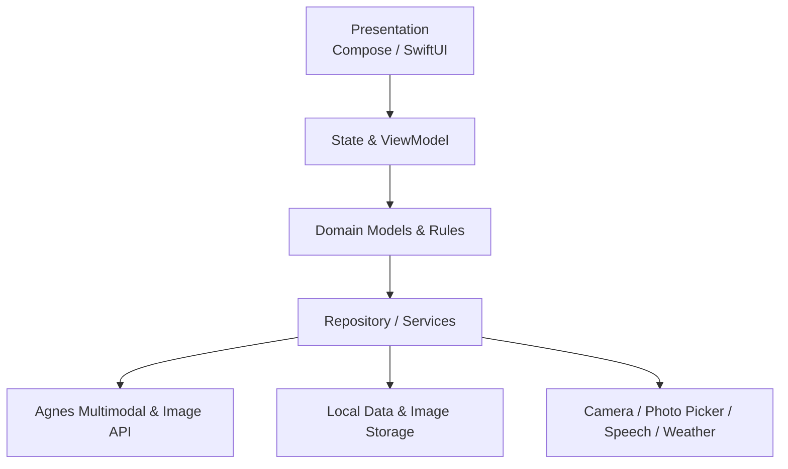
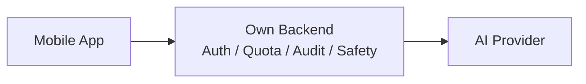

# 双端架构与运行原理

## 架构目标

FeltWords 使用原生 Android 与原生 iOS 实现。两端不共享 UI 代码，但共享产品流程、数据语义、AI 接口契约和设计规范。

这样做的原因：

- 相机、相册、语音和权限高度依赖系统能力。
- 儿童 App 需要精细控制交互反馈、性能和可访问性。
- Jetpack Compose 与 SwiftUI 都适合声明式 UI 和动画。
- 双端可以保持体验目标一致，同时遵循各平台习惯。

## 分层结构



## 核心数据

- `RecognitionResult`：识别出的单词、中文释义、例句、类别和视觉描述。
- `RecognitionHistoryItem`：一次识别结果、图片和识别时间。
- `LearnedWord`：用户主动收藏的单词及学习时间。
- `Storybook`：围绕单词生成的绘本。
- `StoryPage`：绘本中的单页英文句子与插图。

## 核心运行流程

1. 用户拍照或从相册选择图片。
2. 客户端压缩图片并调用多模态识别接口。
3. 识别成功后立即写入历史记录。
4. 客户端生成毛毡风图片，并回填历史记录或单词本封面。
5. 用户可以主动收藏单词。
6. 用户触发绘本生成后，后台生成四页故事与插图。
7. 绘本阅读器逐页朗读，支持暂停和重新播放。

## Android

```text
android/app/src/main/java/com/mima/feltwords/
├── data/       API、Repository、本地存储、天气
├── domain/     领域模型与集合规则
├── speech/     在线朗读与音频播放
└── ui/         Compose 页面、组件、主题和共享状态
```

主要技术：

- Kotlin + Jetpack Compose
- ViewModel + StateFlow + Coroutines
- Retrofit + OkHttp + kotlinx.serialization
- CameraX + Photo Picker
- DataStore + 应用内部文件

## iOS

```text
ios/FeltWords/
├── App/        应用入口与共享状态
├── Models/     数据模型
├── Services/   API、相机、语音、本地存储
├── Components/ 通用 SwiftUI 组件
└── Views/      页面
```

主要技术：

- Swift + SwiftUI
- ObservableObject + async/await
- URLSession
- AVCaptureSession + PhotosUI
- AVSpeechSynthesizer
- UserDefaults + 应用本地文件

## AI 接口与生产环境边界

当前原型客户端直接调用 Agnes API：

- 多模态识别与故事文本：`agnes-2.0-flash`
- 毛毡图与绘本插图：`agnes-image-2.1-flash`

生产环境不应将供应商 API Key 固化在客户端中。推荐增加自有后端代理：



后端需要负责身份认证、用户配额、儿童内容安全、日志审计、密钥保护和数据删除。
